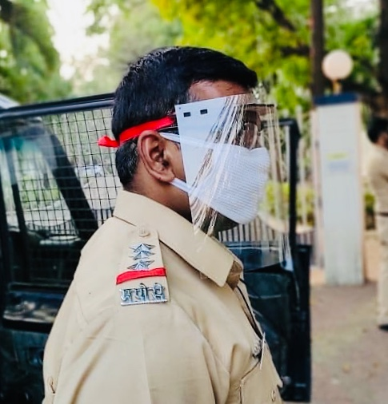
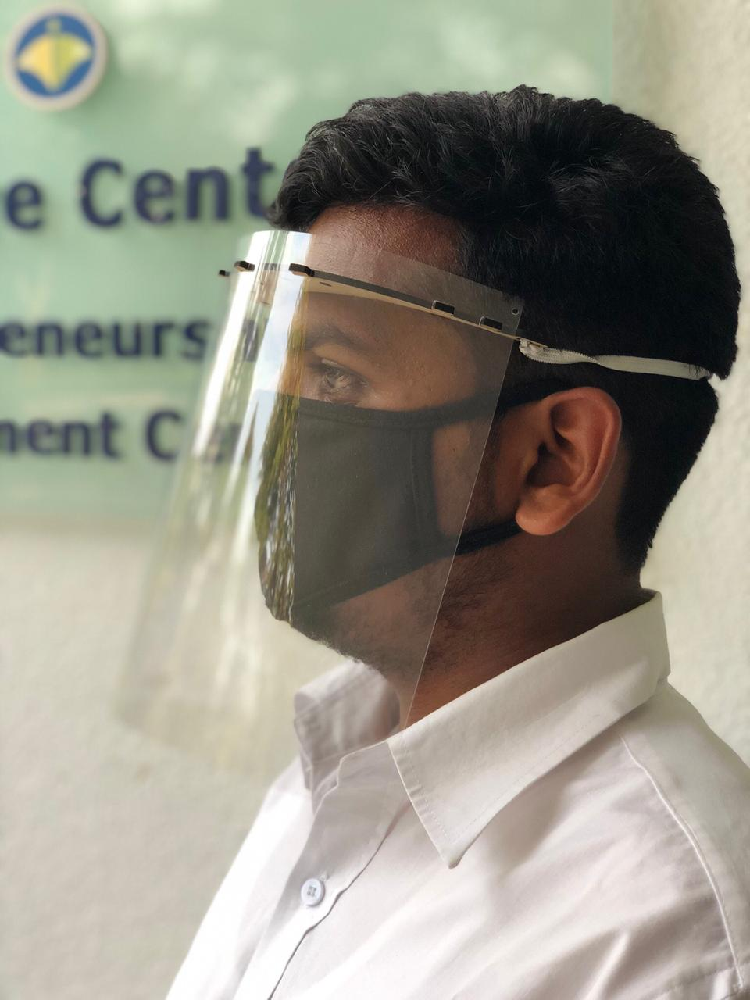
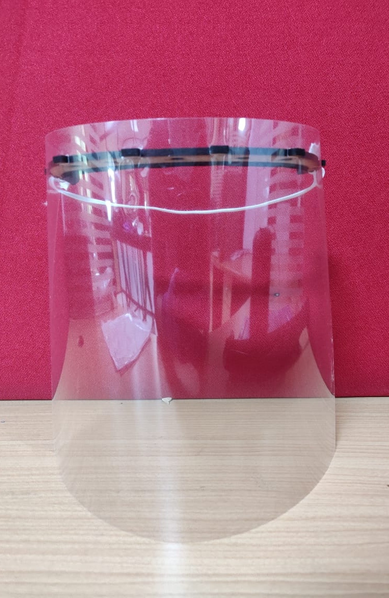
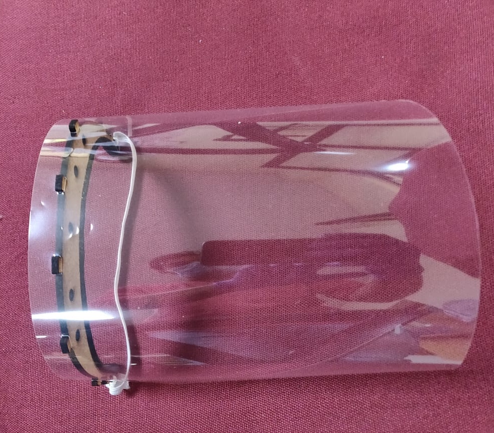

# Astra19
Face Shields For Frontliners
*    
Face Shields can protect Front line workers like healthcare professionals and police from potential virus containing droplets released by coughing, sneezing and other close contacts.

 This work is licensed under a <a rel="license" href="http://creativecommons.org/licenses/by/4.0/">Creative Commons Attribution 4.0 International License</a>.
